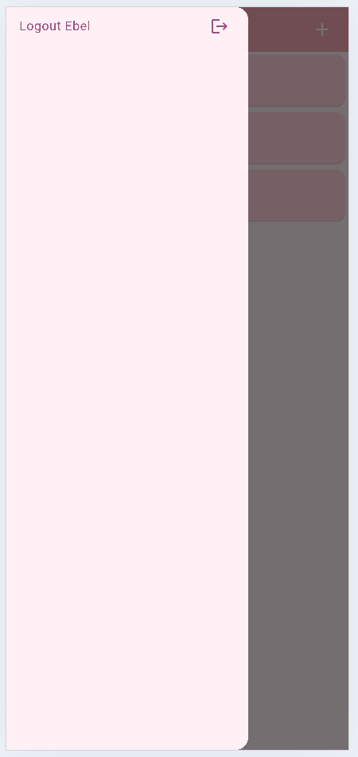
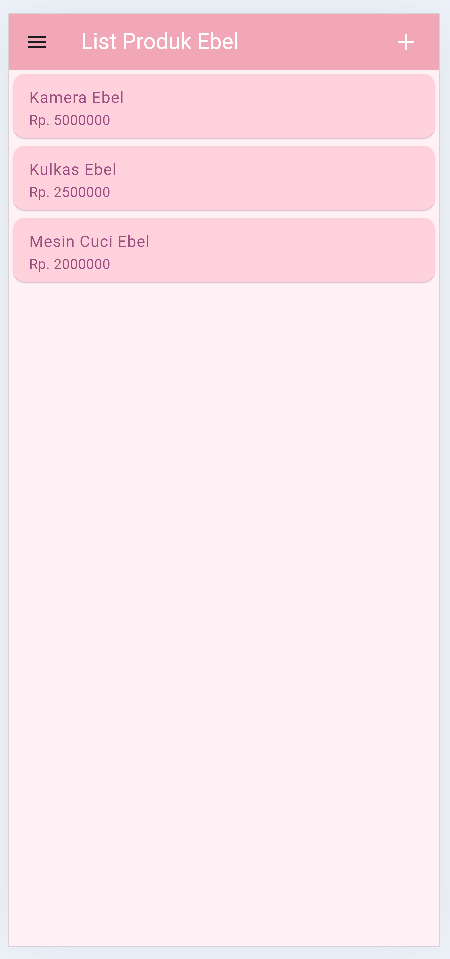
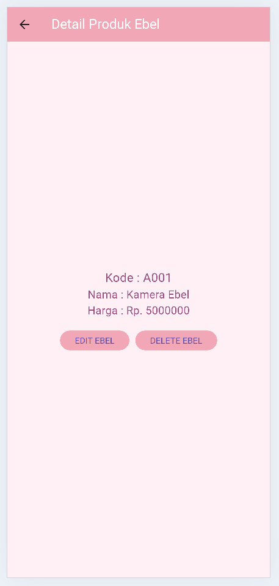
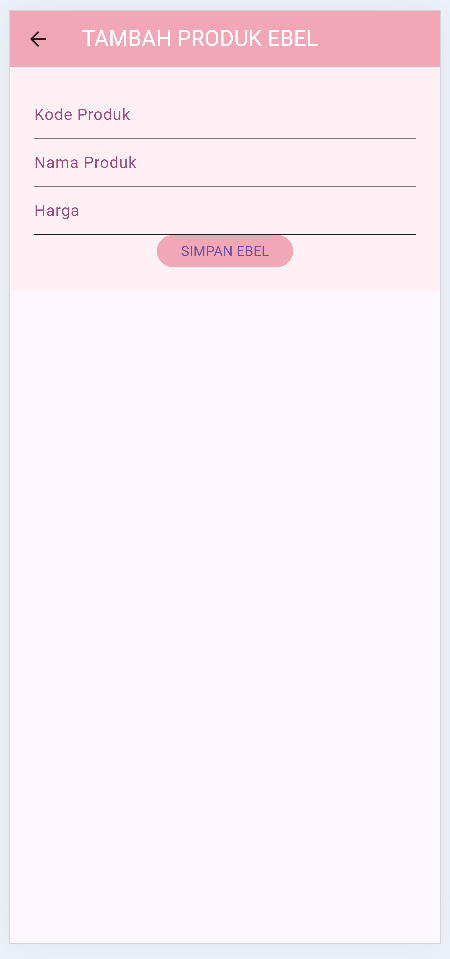
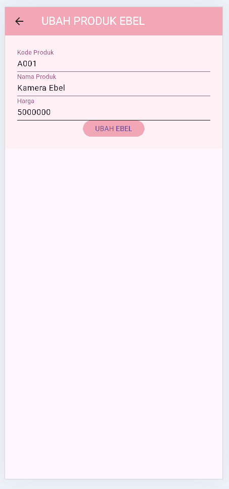
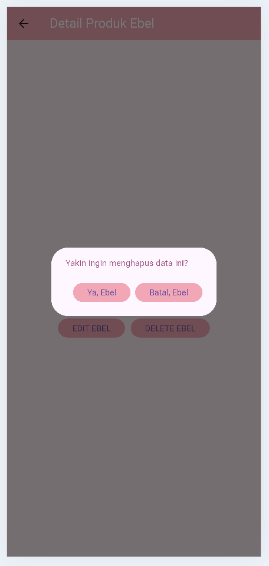

# Tugas Pertemuan 4

**Nama** : Eka Belandini  
**NIM** : H1D022002  
**Shift** : F

## Deskripsi Proyek

Proyek ini merupakan aplikasi mobile sederhana yang dibangun menggunakan Flutter. Aplikasi ini memiliki fitur navigasi menggunakan menu samping (sidemenu) dan menyimpan preferensi pengguna menggunakan Shared Preferences. Desain aplikasi ini menggunakan skema warna pastel yang menawan, dengan fokus pada nuansa pink soft untuk menciptakan pengalaman pengguna yang nyaman dan menyenangkan.

## Fitur Utama

- **Navigasi dengan Menu Samping:** Memudahkan pengguna untuk berpindah antara berbagai bagian aplikasi.
- **Penyimpanan Preferensi Pengguna:** Menggunakan Shared Preferences untuk menyimpan data pengguna secara lokal.
- **Desain Menarik:** Menggunakan skema warna pastel yang menawan, terutama nuansa pink soft, untuk memberikan pengalaman visual yang menyenangkan.

## Teknologi yang Digunakan

- **Flutter:** Framework untuk membangun aplikasi mobile.
- **Dart:** Bahasa pemrograman yang digunakan untuk pengembangan aplikasi Flutter.
- **Shared Preferences:** Paket untuk menyimpan preferensi pengguna secara lokal.

## Demo Aplikasi

Berikut adalah beberapa screenshot dari aplikasi yang menunjukkan tampilan dan fitur yang ada:

### Screenshot Sidemenu



### Screenshot List Produk



### Screenshot Detail Produk



### Screenshot Tambah Produk



### Screenshot Ubah Produk



### Screenshot Hapus Produk



## Cara Menjalankan Aplikasi

1. **Instalasi Flutter**: Pastikan Anda sudah menginstal Flutter di komputer Anda. Jika belum, ikuti petunjuk di [dokumentasi resmi Flutter](https://flutter.dev/docs/get-started/install).
2. **Clone Repository**: Clone repository ini dengan perintah berikut:
   ```bash
   git clone <URL_REPOSITORY>
   ```
