# Tugas Pertemuan 4

**Nama** : Eka Belandini  
**NIM** : H1D022002  
**Shift** : F

---

## Deskripsi Proyek

Proyek ini adalah aplikasi mobile sederhana yang dibangun menggunakan **Flutter**. Aplikasi ini menawarkan fitur navigasi dengan menu samping dan menyimpan preferensi pengguna menggunakan **Shared Preferences**. Desain aplikasi mengusung skema warna pastel yang menawan, dengan fokus pada nuansa **pink soft** untuk menciptakan pengalaman pengguna yang nyaman dan menyenangkan.

---

## Fitur Utama

- **Navigasi dengan Menu Samping (Sidemenu):** Memudahkan pengguna untuk berpindah antara berbagai bagian aplikasi.
- **Penyimpanan Preferensi Pengguna:** Menggunakan Shared Preferences untuk menyimpan data pengguna secara lokal.
- **Desain Menarik:** Menggunakan skema warna pastel yang menawan, terutama nuansa pink soft, untuk memberikan pengalaman visual yang menyenangkan.

---

## Teknologi yang Digunakan

- **Flutter:** Framework untuk membangun aplikasi mobile.
- **Dart:** Bahasa pemrograman yang digunakan untuk pengembangan aplikasi Flutter.
- **Shared Preferences:** Paket untuk menyimpan preferensi pengguna secara lokal.

---

## Cara Menjalankan Aplikasi

1. **Instalasi Flutter:** Pastikan Flutter sudah terinstal di komputer Anda. Jika belum, ikuti petunjuk di [dokumentasi resmi Flutter](https://flutter.dev/docs/get-started/install).
2. **Clone Repository:** Clone repository ini dengan perintah berikut:
   ```bash
   git clone <URL_REPOSITORY>
   ```
3. **Instalasi Dependencies:** Jalankan perintah berikut untuk menginstal dependencies yang diperlukan:
   ```bash
   flutter pub get
   ```
4. **Menjalankan Aplikasi:** Gunakan perintah ini untuk menjalankan aplikasi:
   ```bash
   flutter run
   ```

---

## Alur Penggunaan Aplikasi

### 1. Registrasi
   - Pengguna yang belum memiliki akun dapat melakukan registrasi.
   - Formulir registrasi berisi input untuk **username**, **email**, dan **password**.
   - Setelah berhasil, pengguna diarahkan ke halaman login.
   
   **Screenshot Form Registrasi:**
   <div style="text-align: center;">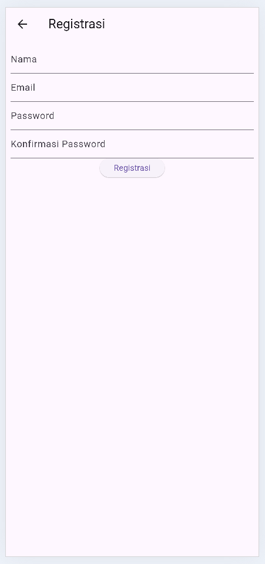</div>

   **Screenshot Registrasi Berhasil:**
   <div style="text-align: center;">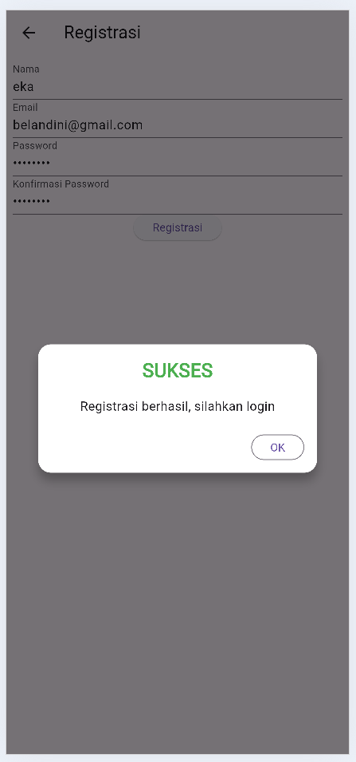</div>

   Berikut adalah potongan kode untuk form registrasi:

   ```dart
   class RegistrasiPage extends StatelessWidget {
   final TextEditingController usernameController = TextEditingController();
   final TextEditingController emailController = TextEditingController();
   final TextEditingController passwordController = TextEditingController();

   @override
   Widget build(BuildContext context) {
      return Scaffold(
         appBar: AppBar(title: Text('Registrasi')),
         body: Padding(
         padding: const EdgeInsets.all(16.0),
         child: Column(
            children: [
               TextField(controller: usernameController, decoration: InputDecoration(labelText: 'Username')),
               TextField(controller: emailController, decoration: InputDecoration(labelText: 'Email')),
               TextField(controller: passwordController, decoration: InputDecoration(labelText: 'Password'), obscureText: true),
               ElevatedButton(onPressed: () { /* Logika Registrasi */ }, child: Text('Daftar')),
            ],
         ),
         ),
      );
   }
   }
   ```

### 2. **Login**
   - Pengguna memasukkan *username* dan *password* di halaman login.
   - Jika kredensial benar, pengguna akan diarahkan ke halaman **List Produk**.
   - Jika login berhasil, popup sukses akan muncul.
   - Jika login gagal, popup kesalahan akan muncul.

   **Screenshot Form Login:**
   <div style="text-align: center;">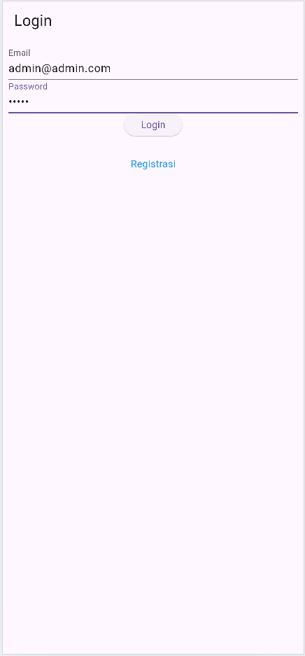</div>

   **Screenshot Login Gagal:**
   <div style="text-align: center;">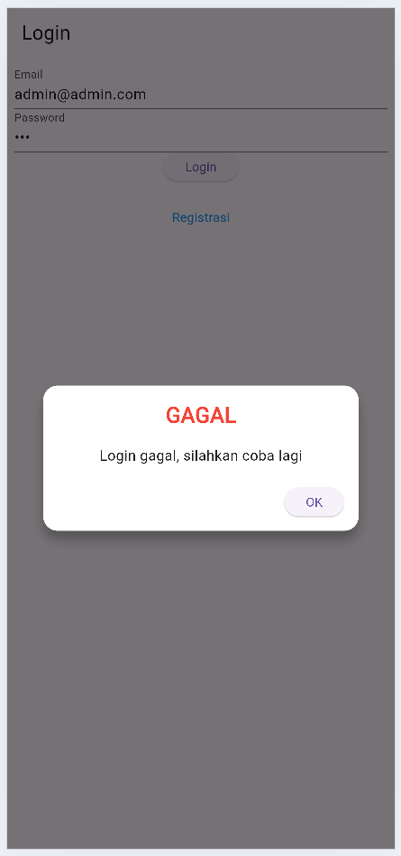</div>

Berikut adalah potongan kode untuk halaman login:

```dart
class LoginPage extends StatelessWidget {
  final TextEditingController usernameController = TextEditingController();
  final TextEditingController passwordController = TextEditingController();

  @override
  Widget build(BuildContext context) {
    return Scaffold(
      appBar: AppBar(title: Text('Login')),
      body: Padding(
        padding: const EdgeInsets.all(16.0),
        child: Column(
          children: [
            TextField(controller: usernameController, decoration: InputDecoration(labelText: 'Username')),
            TextField(controller: passwordController, decoration: InputDecoration(labelText: 'Password'), obscureText: true),
            ElevatedButton(onPressed: () { /* Logika Login */ }, child: Text('Login')),
          ],
        ),
      ),
    );
  }
}
```

### 3. **List Produk**
   - Setelah login, pengguna diarahkan ke halaman **List Produk**.
   - Di halaman ini, pengguna dapat melihat daftar produk yang tersedia, termasuk **nama produk**, dan **harga produk**.
   - Pengguna dapat menekan salah satu produk untuk melihat **Detail Produk**.

   **Screenshot List Produk:**
   <div style="text-align: center;">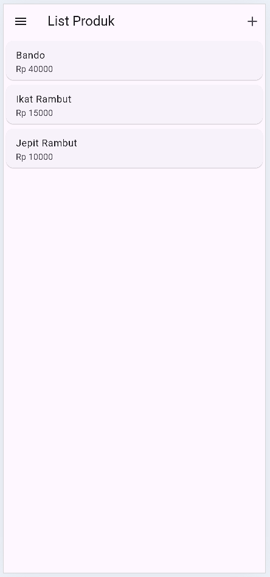</div>

   Berikut adalah potongan kode untuk menampilkan daftar produk:

   ```dart
   class ListProdukPage extends StatelessWidget {
   final List<Product> products; // Daftar produk

   @override
   Widget build(BuildContext context) {
      return Scaffold(
         appBar: AppBar(title: Text('List Produk')),
         body: ListView.builder(
         itemCount: products.length,
         itemBuilder: (context, index) {
            return ListTile(
               title: Text(products[index].name),
               subtitle: Text('Harga: ${products[index].price}'),
               onTap: () { /* Navigasi ke Detail Produk */ },
            );
         },
         ),
      );
   }
   }
   ```

### 4. **Tambah Produk**
   - Pengguna dapat menambahkan produk baru melalui halaman **Tambah Produk**.
   - Formulir tambah produk berisi input untuk **kode produk**, **nama produk**, dan **harga produk**.
   - Setelah mengisi data, pengguna menekan tombol **Simpan**, dan produk baru ditambahkan ke database.

   **Screenshot Tambah Produk:**
   <div style="text-align: center;">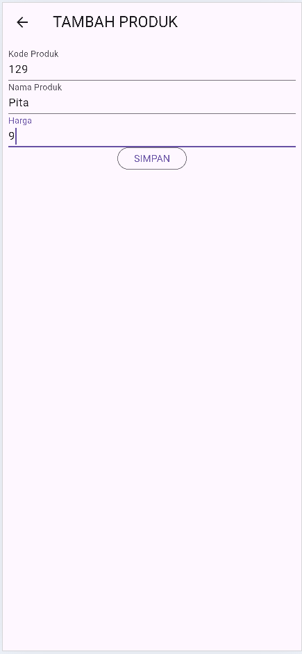</div>

   **Screenshot Tambah Produk Berhasil:**
   <div style="text-align: center;">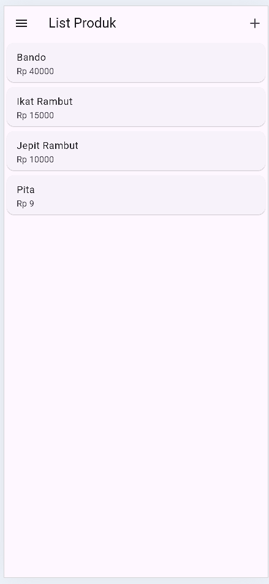</div>

   Berikut adalah potongan kode untuk form tambah produk:

   ```dart
   class TambahProdukPage extends StatelessWidget {
   final TextEditingController kodeController = TextEditingController();
   final TextEditingController namaController = TextEditingController();
   final TextEditingController hargaController = TextEditingController();

   @override
   Widget build(BuildContext context) {
      return Scaffold(
         appBar: AppBar(title: Text('Tambah Produk')),
         body: Padding(
         padding: const EdgeInsets.all(16.0),
         child: Column(
            children: [
               TextField(controller: kodeController, decoration: InputDecoration(labelText: 'Kode Produk')),
               TextField(controller: namaController, decoration: InputDecoration(labelText: 'Nama Produk')),
               TextField(controller: hargaController, decoration: InputDecoration(labelText: 'Harga Produk')),
               ElevatedButton(onPressed: () { /* Logika Tambah Produk */ }, child: Text('Simpan')),
            ],
         ),
         ),
      );
   }
   }
   ```

### 5. **Detail Produk**
   - Setelah menekan salah satu produk di halaman **List Produk**, pengguna akan diarahkan ke halaman **Detail Produk**.
   - Di halaman ini, pengguna dapat melihat detail lengkap produk, seperti **kode produk**, **nama produk**, dan **harga produk**.
   - Terdapat tombol untuk **Edit** dan **Hapus** produk.

   **Screenshot Detail Produk:**
   <div style="text-align: center;">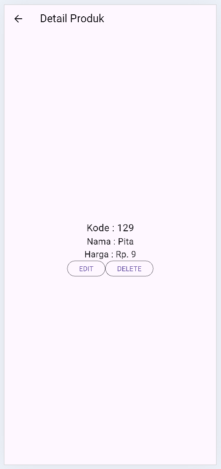</div>

   Berikut adalah potongan kode untuk detail produk:
   ```dart
   class DetailProdukPage extends StatelessWidget {
   final Product product;

   @override
   Widget build(BuildContext context) {
      return Scaffold(
         appBar: AppBar(title: Text(product.name)),
         body: Column(
         children: [
            Text('Kode: ${product.code}'),
            Text('Harga: ${product.price}'),
            ElevatedButton(onPressed: () { /* Navigasi ke Edit Produk */ }, child: Text('Edit')),
            ElevatedButton(onPressed: () { /* Hapus Produk */ }, child: Text('Hapus')),
         ],
         ),
      );
   }
   }
   ```

### 6. **Edit Produk**
   - Pengguna dapat melakukan perubahan pada data produk di halaman **Detail Produk** dengan menekan tombol **Edit**.
   - Setelah menekan tombol **Edit**, pengguna diarahkan ke halaman **Form Edit Produk**.
   - Setelah mengedit data, pengguna menekan tombol **Simpan** untuk memperbarui produk.

   **Screenshot Ubah Produk:**
   <div style="text-align: center;">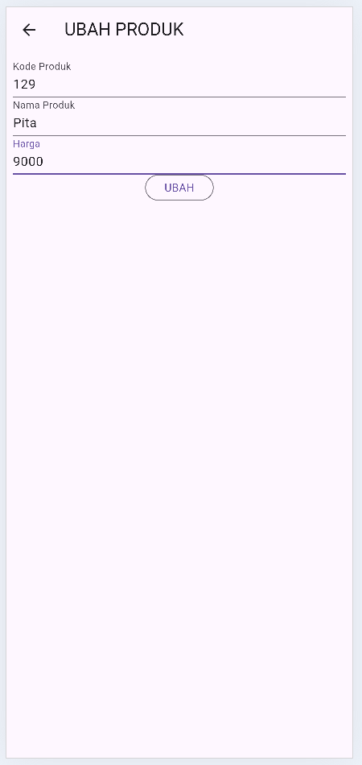</div>

   **Screenshot Ubah Produk Berhasil:**
   <div style="text-align: center;">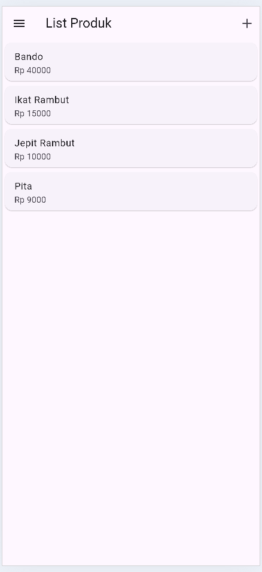</div>

   Berikut adalah potongan kode untuk edit produk:
   ```dart
   class EditProdukPage extends StatelessWidget {
   final Product product;

   @override
   Widget build(BuildContext context) {
      final TextEditingController namaController = TextEditingController(text: product.name);
      final TextEditingController hargaController = TextEditingController(text: product.price.toString());

      return Scaffold(
         appBar: AppBar(title: Text('Edit Produk')),
         body: Padding(
         padding: const EdgeInsets.all(16.0),
         child: Column(
            children: [
               TextField(controller: namaController, decoration: InputDecoration(labelText: 'Nama Produk')),
               TextField(controller: hargaController, decoration: InputDecoration(labelText: 'Harga Produk')),
               ElevatedButton(onPressed: () { /* Logika Edit Produk */ }, child: Text('Simpan')),
            ],
         ),
         ),
      );
   }
   }
   ```

### 7. **Hapus Produk**
   - Pengguna dapat menghapus produk melalui halaman **Detail Produk** dengan menekan tombol **Delete**.
   - Setelah menekan tombol **Delete**, akan muncul popup konfirmasi untuk memastikan penghapusan produk.
   - Jika pengguna menekan **Ya**, produk akan dihapus dari database.

   **Screenshot Hapus Produk:**
   <div style="text-align: center;">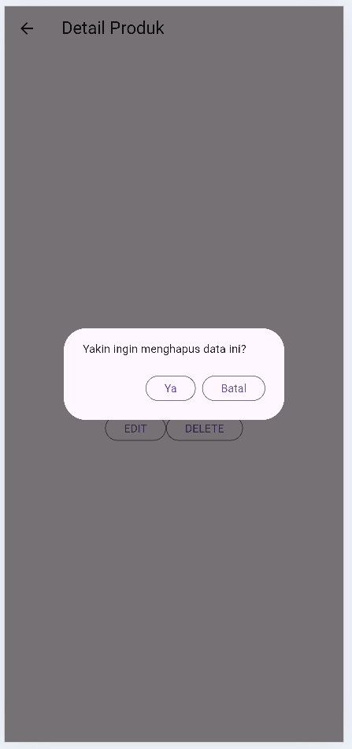</div>

   **Screenshot Hapus Produk Berhasil:**
   <div style="text-align: center;">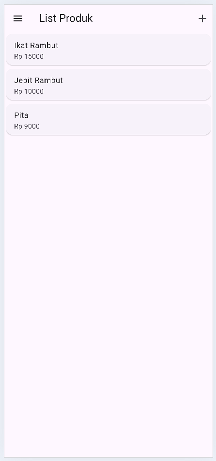</div>

   Berikut adalah potongan kode untuk hapus produk:
   ```dart
   void hapusProduk(BuildContext context) {
   showDialog(
      context: context,
      builder: (context) {
         return AlertDialog(
         title: Text('Konfirmasi Hapus'),
         content: Text('Apakah Anda yakin ingin menghapus produk ini?'),
         actions: [
            TextButton(onPressed: () { /* Hapus Produk */ }, child: Text('Ya')),
            TextButton(onPressed: () { Navigator.of(context).pop(); }, child: Text('Tidak')),
         ],
         );
      },
   );
   }
   ```

### 8. **Navigasi dengan Sidemenu**
   - Setelah login, pengguna dapat mengakses menu samping (sidemenu) untuk **logout** dari sistem.
   
   **Screenshot Sidemenu:**
   <div style="text-align: center;">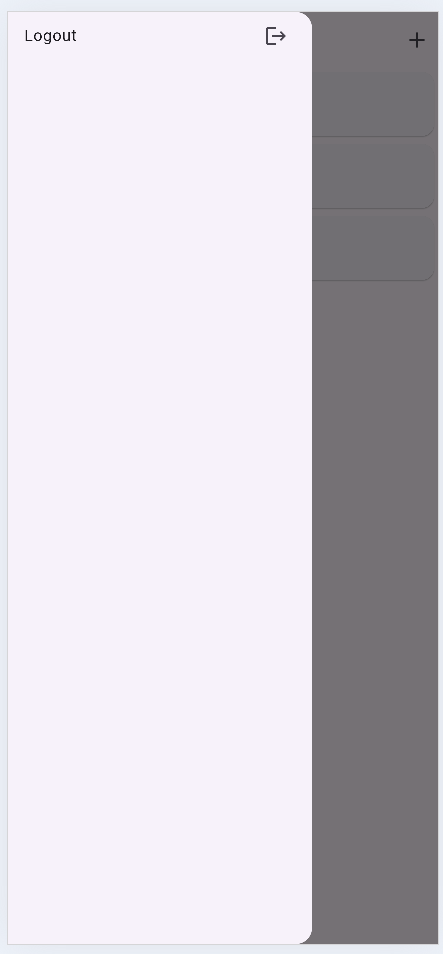</div>

   Berikut adalah potongan kode untuk Sidemenu:
   ```dart
   class Sidemenu extends StatelessWidget {
   @override
   Widget build(BuildContext context) {
      return Drawer(
         child: ListView(
         children: [
            ListTile(title: Text('Logout'), onTap: () { /*

   Logika Logout */ }),
         ],
         ),
      );
   }
   }
   ```

### 9. **Logout**
   - Pengguna dapat logout dengan menekan opsi **Logout** di sidemenu.
   - Setelah logout, pengguna akan diarahkan kembali ke halaman login.

   **Screenshot Logout Berhasil:**
   <div style="text-align: center;">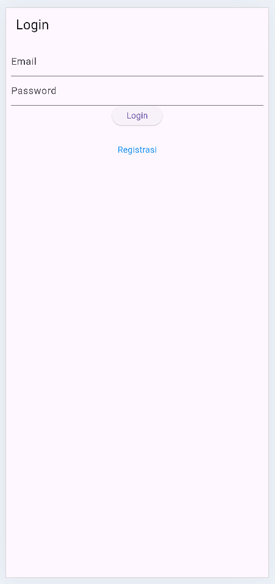</div>

---

## Kesimpulan

Proyek ini menunjukkan penggunaan Flutter dalam pengembangan aplikasi mobile dengan fitur-fitur menarik dan antarmuka yang ramah pengguna. Dengan implementasi Shared Preferences, aplikasi ini dapat menyimpan preferensi pengguna secara lokal, memberikan pengalaman yang lebih baik dan personal.

